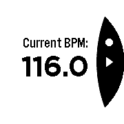

# bpm-pebble

## Usage

* Press the top button to the beat to get the BPM.
* Once a BPM is visible, press the middle button to start a metronome at that
  BPM.
* Start recording a new BPM by waiting two seconds before tapping the top button
  again.
